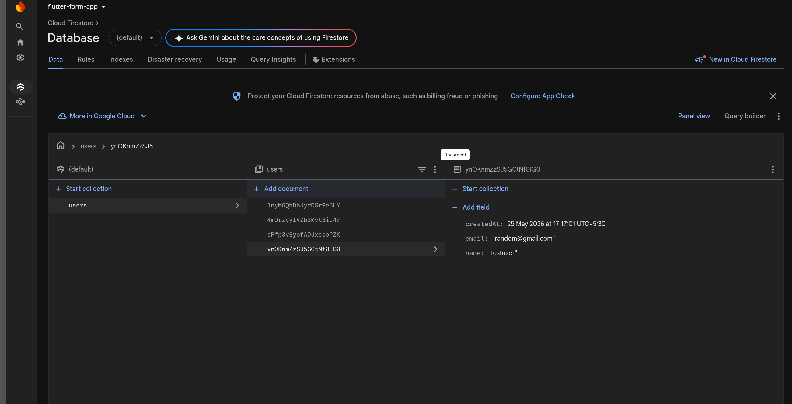
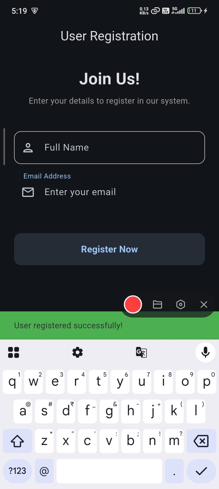

# 🚀 Flutter Firebase Registration Form

[](https://flutter.dev)
[](https://firebase.google.com)
[](LICENSE)

A professional, beginner-friendly Flutter application demonstrating seamless integration with **Firebase Firestore**. This project features a modern user registration form with real-time validation and data persistence.

---

## 📸 Screenshots & Demo

<p align="center">
  
  
</p>

<p align="center">
  <b>🎥 <a href="assets/videos/demo.mp4">Watch the Demo Video</a></b>
</p>

---

## ✨ Features

- **Modern UI/UX**: Built with Material 3 and a sleek dark theme.
- **Form Validation**: Real-time validation for names and email formats.
- **Firebase Integration**: Direct connection to Cloud Firestore for data storage.
- **Loading States**: Visual feedback during asynchronous operations.
- **Responsive Design**: Optimized for various screen sizes and orientations.
- **Clean Architecture**: Separation of UI, business logic, and services.

---

## 🛠 Tech Stack

- **Frontend**: [Flutter](https://flutter.dev) (Dart)
- **Backend**: [Firebase Firestore](https://firebase.google.com/docs/firestore)
- **Dependencies**:
  - `firebase_core`: For Firebase initialization.
  - `cloud_firestore`: For database operations.

---

## 📁 Project Structure

```text
lib/
├── main.dart                 # App entry point & Theme configuration
├── screens/
│   └── form_screen.dart      # Main UI with Form and State management
├── services/
│   └── firestore_service.dart # Firestore CRUD operations
└── widgets/
    └── custom_textfield.dart # Modular & Reusable UI component
```

---

## 🚀 Installation & Setup

### Prerequisites
- Flutter SDK installed
- A Firebase Project

### Steps
1. **Clone the repository**
   ```bash
   git clone https://github.com/your-username/firebase-form-app.git
   cd firebase-form-app
   ```

2. **Install Dependencies**
   ```bash
   flutter pub get
   ```

3. **Firebase Configuration**
   - Create a project in the [Firebase Console](https://console.firebase.google.com/).
   - Add an Android app and place `google-services.json` in `android/app/`.
   - Add an iOS app and place `GoogleService-Info.plist` in `ios/Runner/`.
   - Run `flutterfire configure` or manually add `lib/firebase_options.dart`.
   - *Note: These files are excluded from this repository for security reasons.*
   - Enable **Cloud Firestore** in "Test Mode".

4. **Run the App**
   ```bash
   flutter run
   ```

---

## 🔐 Firestore Security Rules

For development/testing purposes, use the following rules:

```javascript
service cloud.firestore {
  match /databases/{database}/documents {
    match /users/{document=**} {
      allow read, write: if true;
    }
  }
}
```

---

## 📈 Future Improvements

- [ ] User Authentication (Firebase Auth)
- [ ] Image upload for user profile
- [ ] Admin dashboard to view all registered users
- [ ] Offline data persistence logic
- [ ] Unit and Widget testing

---

## 📄 License

Distributed under the MIT License. See `LICENSE` for more information.

---

## 👤 Author

**Naitik Raj**
- GitHub: [@your-username](https://github.com/your-username)
- LinkedIn: [Your Profile](https://linkedin.com/in/your-profile)
